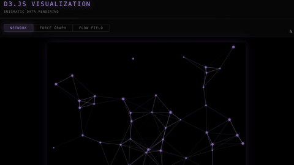

  
  
  <h1 align="center">D3.JS TEST</h1>
  <h3 align="center"> A Dᴇᴍᴏɴsᴛʀᴀᴛɪᴏɴ Sᴜɪᴛᴇ ɪɴᴛᴇɢʀᴀᴛɪɴɢ D3.ᴊs Pʜʏsɪᴄs Vɪsᴜᴀʟɪᴢᴀᴛɪᴏɴs </h3>

  <!-- TOP PURPLE LINKS -->
  
  
  
   
  <!-- BOTTOM GOLD TAXONOMY -->
  
  
  
  

  
<i>A demonstration suite integrating the D3.js library to render interactive network graphs, force-directed layouts, and generative flow fields.</i>

---

## 📌 Introduction & Overview

**D3.JS Test** is a premium data visualization component designed for Obsidian and Datacore that renders beautiful, hardware-accelerated SVG physics simulations. It features a fully integrated tabbed interface that lets users toggle dynamically between three distinct graph modes: a proximity-based network, an interactive force-directed graph, and an animated particle flow field.

The component contains intelligent dependency loading that checks for the D3.js library, downloads it from a CDN on first-run if missing, and caches it locally within the vault folder (`.datacore/script_cache`) for full offline capability. It supports full-tab leaf expansion with automatic status bar suppression and cleanly isolates its active frame loops to prevent memory leaks during tab switching or unmounting.

---

## ✨ Features

### 🌐 Dependency Caching & Offline Support
* **Smart Loader Interface**: Detects whether D3.js is active in the global context, automatically fetching and writing the library binaries to a local vault directory (`.datacore/script_cache`) if missing.
* **Offline Functionality**: Mounts D3.js directly from the local cache on all subsequent loads, avoiding network overhead and enabling offline use.

### 📊 Physics-Based Visualizations
* **Proximity Network**: Node array that moves inside boundary coordinates, rendering linking edges that fade dynamically based on the distance between nodes.
* **Interactive Force Graph**: Classic force-directed layout where nodes repel and attract, supporting drag events to dynamically update physics simulation states.
* **Flow Field Trails**: Particle system following a trigonometric flow field, drawing fading canvas-like path trails.

### 🖥️ Scoped Integration & Layout
* **Full-Tab Isolation**: Renders edge-to-edge inside workspace leaves with an invisible hover trigger to exit the view pane.
* **Status Bar Suppression**: Hides bottom-right status bars when expanded to maintain visual purity.
* **Active Frame Cleanup**: Safely halts simulation ticks and clears anim loops on tab changes or unmounting.

---

## 📦 Directory Index & Components

The package exposes the following compiled files:

| File | Description |
| :--- | :--- |
| **[D3.JS TEST.md](D3.JS%20TEST.md)** | The main entry point note containing metadata frontmatter and the live `datacorejsx` rendering block. |
| **[src/index.jsx](src/index.jsx)** | Synchronous entry point that dynamically resolves paths and imports the App module. |
| **[src/App.jsx](src/App.jsx)** | View manager handling panel hooks, full-tab leaf injection, status bar overrides, and tab controls. |
| **[src/utils/d3Charts.js](src/utils/d3Charts.js)** | Core rendering algorithms for the three D3 graphs with canvas/SVG initialization and frame animation cleanup functions. |
| **[METADATA.md](METADATA.md)** | Package indexing manifest outlining dependencies, compatibility, and version metrics. |
| **[README.md](README.md)** | Standard repository document containing setup instructions and details. |
| **[LICENSE.md](LICENSE.md)** | MIT permissible software distribution license. |
| **[CONTRIBUTION.md](CONTRIBUTION.md)** | Development engineering specifications and styling guidelines. |
| **[assets/d3jstest.clip.gif](assets/d3jstest.clip.gif)** | High-fidelity GIF demonstrating the visualizer. |

---

## 👥 Contributors

* **beto.group** (Main developer of the D3.JS Test suite)
